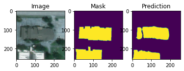

# EvoScape

## 🌍 Overview
### What is EvoScape?
From "Evolve" + "Landscape" = Evolution of landscapes monitored through AI.
##
Landscape Change Detection is a computer vision-based project that leverages satellite imagery and machine learning techniques to track changes in urban and natural environments over time. This system is particularly useful for monitoring deforestation, urban expansion, infrastructure development, and disaster impact assessment.

### How Does It Work?
1. **Building Detection:** The model processes high-resolution satellite images to identify structures such as buildings.
2. **Change Detection:** By comparing images taken at different time intervals, the model highlights alterations in landscapes due to urbanization, natural disasters, or other factors.
3. **Deep Learning Integration:** A pre-trained deep learning model (`model_output.h5`) enables automatic inference for large-scale change detection.

## 📂 Files in Repository
```
├── Building detection.ipynb    # Jupyter Notebook for building detection
├── change_detect.ipynb         # Jupyter Notebook for landscape change detection
├── model_output.h5             # Pre-trained model for inference
├── README.md                   # Project documentation
```

## 🛠️ Installation
### 1️⃣ Clone the Repository
```
git clone https://github.com/KARALKIRTI/EvoScape.git
cd EvoScape
```
### 2️⃣ Setup Environment
```
pip install -r requirements.txt
```

## 🚀 Usage
### 1️⃣ Run Building Detection
- Open `Building detection.ipynb` in Jupyter Notebook and execute the cells to detect buildings in satellite imagery.

### 2️⃣ Run Change Detection
- Open `change_detect.ipynb` and run the analysis to compare two images taken at different times, highlighting changes in the landscape.

### 3️⃣ Use Pre-Trained Model
- Load `model_output.h5` in any deep learning framework like TensorFlow or Keras to analyze new satellite images.

## 📊 Results
### 🏢 Building Detection Output
The following is an example output where detected buildings are highlighted in yellow:



## 🔮 Future Enhancements
- **Avalanche Delineation:** The next iteration of this project will focus on mapping avalanche-prone areas using similar image processing techniques.
- **Enhanced Accuracy:** Improving model precision by incorporating more diverse training datasets.
- **Cloud-based Processing:** Deploying the model on a cloud-based system for real-time monitoring and large-scale analysis.

---
🚀 Stay tuned for future updates and improvements!
